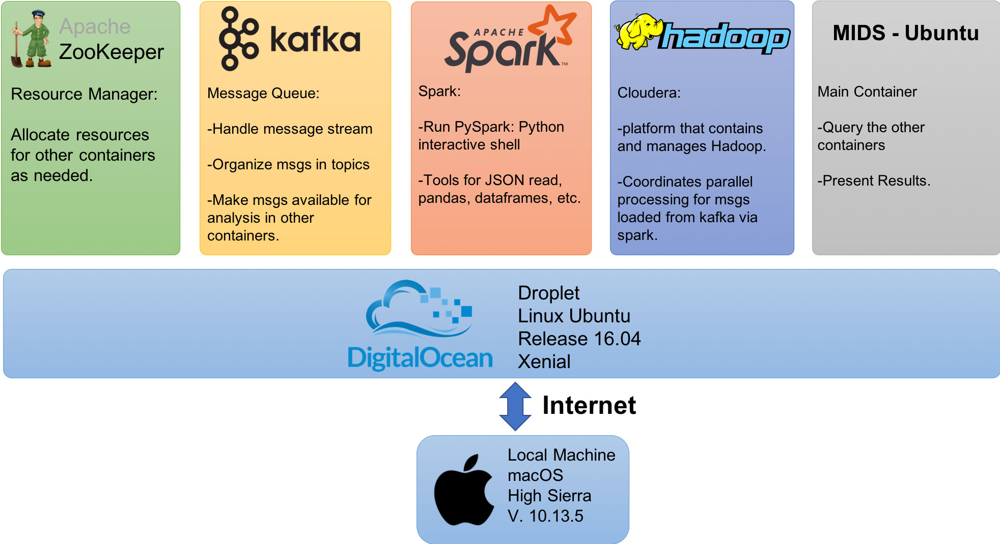

# Project 2 - Tracking User Info
### MIDS - University of California Berkeley
### Marcelo Scatolin Queiroz

#### Note for students using this repo:
Here are the files of my work during my Data engineering class for MIDS. I published them here as a way to encourage self-development and learning. Please, do not copy this files as a full answer to your assignments. This is against Berkeley's code of conduct, highly unethical and the worst, you will not learn as intended.

Feel free to reach out to me with questions, suggestions and critics.

## Executive Summary

This is the Markdown file that explains the work done as assignment 08, for W205 - Fundamentals of Data Engineering, section 5, Summer 2018.

In the assignments 6 to 8 we were encouraged to verify the differences and similarities of dealing with data coming from a user activity log saved as a JSON file. For that we used a cloud droplet provided by Digital Ocean and different Docker containers according to the complexity of the assignment and the analysis required.

This document intends to resume how those technologies were used presenting the commands needed and the results achieved, together with comments about them.

## Introduction

In Project 2 we intend to prepare a service that delivers assessments for customers in the e-learning business. Therefore, we need to prepare our services to allow data scientists that work for those customers to run queries against our data.

The first step was to set up the architecture in which this service runs. Later on we ran an example using a dataset of assessments formatted as a JSON file with 3280 assessments for different online courses. The results are discussed on the following sections.

## Architecure

The architecture used consists of 5 containers on top of a Linux Ubuntu Distribution running in a Digital Ocean Droplet. As we can see in Figure 01, each of them has an use and they communicate through ports specified in the docker-compose.yml file presented next.



The following file defines how which container will run and interact with each other. We can find 4 services composing the services section:
* zookepper: based on the default Confluent Inc image, communicates through port 32181
* kafka: based on the default Confluent Inc image, depends on zookeeper resources allocation, communicates through port 29092 and build a volume on our host machine (located at /home/science/w205/)
* cloudera: based on a docker image provided by Cloudera company, this is the container that hosts the Hadoop file system and coordinates the queries against it. Communicates through ports 8020 and 50070, and also maps our local port 8888 to the port 8888 on this cluster.
* spark: based on MIDS provided image, allow external commands to the standard input, allow tty and build a volume on our host machine (located at /home/science/w205/). This will use the cloudera container as the Hadoop server, and, therefore, will depends on cloudera.
* mids: based on MIDS provided image, allow external commands to the standard input, allow tty and build a volume on our host machine (located at /home/science/w205/)

```{yml}
version: '2'
services:
  zookeeper:
    image: confluentinc/cp-zookeeper:latest
    environment:
      ZOOKEEPER_CLIENT_PORT: 32181
      ZOOKEEPER_TICK_TIME: 2000
    expose:
      - "2181"
      - "2888"
      - "32181"
      - "3888"
    extra_hosts:
      - "moby:127.0.0.1"

  kafka:
    image: confluentinc/cp-kafka:latest
    depends_on:
      - zookeeper
    environment:
      KAFKA_BROKER_ID: 1
      KAFKA_ZOOKEEPER_CONNECT: zookeeper:32181
      KAFKA_ADVERTISED_LISTENERS: PLAINTEXT://kafka:29092
      KAFKA_OFFSETS_TOPIC_REPLICATION_FACTOR: 1
    expose:
      - "9092"
      - "29092"
    extra_hosts:
      - "moby:127.0.0.1"

  cloudera:
    image: midsw205/cdh-minimal:latest
    expose:
      - "8020" # nn
      - "50070" # nn http
      - "8888" # hue
    #ports:
    #- "8888:8888"
    extra_hosts:
      - "moby:127.0.0.1"

  spark:
    image: midsw205/spark-python:0.0.5
    stdin_open: true
    tty: true
    volumes:
      - ~/w205:/w205
    command: bash
    depends_on:
      - cloudera
    environment:
      HADOOP_NAMENODE: cloudera
    extra_hosts:
      - "moby:127.0.0.1"

   mids:
    image: midsw205/base:latest
    stdin_open: true
    tty: true
    volumes:
      - ~/w205:/w205
    extra_hosts:
      - "moby:127.0.0.1"

   ```
Additionally all containers communicates to the host machine using the localhost address.

## Work structure

As we are working with different containers and services, it is a good idea to work with multiple windows, monitoring logs and being able to work in different instances at the same time for sanity checks. This way, I used three terminals through this assignments:
* The first running commands to mids container directly from my droplet, checking the json file for sanity check.
* The second running pySpark, our interactive Python shell for quering the database.
* The third running HDFS system (on cloudera container).
* The fourth running kafka logs, to make sure the message queue was handling the messages published correctly.

In this report you will find elements of the four terminal histories in cronological order, but the complete one can be seen in separate files in the repo (Some history files were slightly modified to focus on the content useful for this assignment). For each step taken, an explanation is provided in the form:

#### Step explanation
```
command used
```
Additional explanation (if necessary)

## Step by Step solution

#### Check if the yml file used in last section is ok
```
vim docker-compose.yml
```
This is the file added to this repo as well

#### Spin up the cluster with the 5 mentioned containers
```
docker-compose up -d
```
The cluster is running headless (-d option) to allow us controlling using them as microservices from our host machine.

#### Opening kafka logs
```
docker-compose logs -f kafka
```
Here we can see in real times when messages are being delivered to Kafka (our main interest now) as well as other events happens.

#### Checking the content of the hadoop distributed file system (hdfs)
```
docker-compose exec cloudera hadoop fs -ls /tmp/
```
Made on window 3, and the result, as expected, was a folder with only systems files:
```
Found 2 items
drwxrwxrwt   - mapred mapred              0 2018-02-06 18:27 /tmp/hadoop-yarn
drwx-wx-wx   - root   supergroup          0 2018-07-09 05:28 /tmp/hive
```

#### Check kafka topics if something is there
```
docker-compose exec kafka kafka-topics --list --zookeeper zookeeper:32181
```
Ideally no topic should be, other than the default kafka ones. In this case the only returned was "confluent.support.metrics"

#### Creating user activity topic:
```
docker-compose exec kafka kafka-topics \
  --create \
  --topic usr_act_tracker \
  --partitions 1 \
  --replication-factor 1 \
  --if-not-exists \
  --zookeeper zookeeper:32181
```
Line split for clarity. We are creating a topic called usr_act_tracker in one partition, with a replication factor of 1 (no replication) only if this topic does not already exists (no overwriting) and zookeeper is in container called zookeeper on port 32181. The output also returned an interesting WARNING about topic naming issues. So it was noted that we must use only _ case needed from now on.

```
WARNING: Due to limitations in metric names, topics with a period ('.') or underscore ('_') could collide. To avoid issues it is best to use either, but not both.
Created topic "usr_act_tracker".
```

#### Double check if the topic was created:
```
docker-compose exec kafka kafka-topics \
  --describe \
  --topic usr_act_tracker \
  --zookeeper zookeeper:32181
```
the output was:
```
Topic:usr_act_tracker	PartitionCount:1	ReplicationFactor:1	Configs:
	Topic: usr_act_tracker	Partition: 0	Leader: 1	Replicas: 1	Isr: 1
```

#### publish the user activity json file to topic:
```
docker-compose exec mids \
  bash -c "cat /w205/spark-with-kafka-and-hdfs/assessment-attempts-20180128-121051-nested.json \
    | jq '.[]' -c \
    | kafkacat -P -b kafka:29092 -t commits"
```

#### Executing pyspark to initiate analisys using Python syntax (Window 2)
```
docker-compose exec spark pyspark
```

#### First look at the json file
```
cat assessment-attempts-20180128-121051-nested.json | more
```
Not really useful, but we can have an idea of what's inside.

#### using jq to look to the file in a formated way
```
docker-compose exec mids bash -c "cat /w205/spark-with-kafka/assessment-attempts-20180128-121051-nested.json | jq '.[]' | more -d"
```
Also added "more -d" to be able to ready the first key.

#### Reading the first key again, in a different way
```
docker-compose exec mids bash -c "cat /w205/spark-with-kafka/assessment-attempts-20180128-121051-nested.json | jq '.[0]'"
```
Idea is to check against a pySpark dataframe and a hadoop later

#### Reading the last key
```
docker-compose exec mids bash -c "cat /w205/spark-with-kafka/assessment-attempts-20180128-121051-nested.json | jq '.[-1]'"
```
Idea is to check against a pySpark dataframe and a hadoop later

#### Reading all exam names (Window 2)
```
docker-compose exec mids bash -c "cat /w205/spark-with-kafka/assessment-attempts-20180128-121051-nested.json | jq '.[]|{exam_name}'"
```
We see that all names are courses, which tells us something about our dataset.

#### Subscribe into topic and save it to dataframe called messages (Window 2)
```
messages = spark \
  .read \
  .format("kafka") \
  .option("kafka.bootstrap.servers", "kafka:29092") \
  .option("subscribe","usr_act_tracker") \
  .option("startingOffsets", "earliest") \
  .option("endingOffsets", "latest") \
  .load()
```

#### Saving the messages DF to containers cache (Window 2):
```
messages.cache()
```
This was made to suppress warning messages working with cached data.

#### Check messages schema (Window 2)
```
messages.printSchema()
```
Check the messages schema. Output was:
```
root
 |-- key: binary (nullable = true)
 |-- value: binary (nullable = true)
 |-- topic: string (nullable = true)
 |-- partition: integer (nullable = true)
 |-- offset: long (nullable = true)
 |-- timestamp: timestamp (nullable = true)
 |-- timestampType: integer (nullable = true)
 ```

#### Read the first 20 messages (Window 2)
```
messages.show()
```
We have binary values, which are not that useful:
```
+----+--------------------+---------------+---------+------+--------------------+-------------+
| key|               value|          topic|partition|offset|           timestamp|timestampType|
+----+--------------------+---------------+---------+------+--------------------+-------------+
|null|[7B 22 6B 65 65 6...|usr_act_tracker|        0|     0|1969-12-31 23:59:...|            0|
|null|[7B 22 6B 65 65 6...|usr_act_tracker|        0|     1|1969-12-31 23:59:...|            0|
|null|[7B 22 6B 65 65 6...|usr_act_tracker|        0|     2|1969-12-31 23:59:...|            0|
|null|[7B 22 6B 65 65 6...|usr_act_tracker|        0|     3|1969-12-31 23:59:...|            0|
|null|[7B 22 6B 65 65 6...|usr_act_tracker|        0|     4|1969-12-31 23:59:...|            0|
|null|[7B 22 6B 65 65 6...|usr_act_tracker|        0|     5|1969-12-31 23:59:...|            0|
|null|[7B 22 6B 65 65 6...|usr_act_tracker|        0|     6|1969-12-31 23:59:...|            0|
|null|[7B 22 6B 65 65 6...|usr_act_tracker|        0|     7|1969-12-31 23:59:...|            0|
|null|[7B 22 6B 65 65 6...|usr_act_tracker|        0|     8|1969-12-31 23:59:...|            0|
|null|[7B 22 6B 65 65 6...|usr_act_tracker|        0|     9|1969-12-31 23:59:...|            0|
|null|[7B 22 6B 65 65 6...|usr_act_tracker|        0|    10|1969-12-31 23:59:...|            0|
|null|[7B 22 6B 65 65 6...|usr_act_tracker|        0|    11|1969-12-31 23:59:...|            0|
|null|[7B 22 6B 65 65 6...|usr_act_tracker|        0|    12|1969-12-31 23:59:...|            0|
|null|[7B 22 6B 65 65 6...|usr_act_tracker|        0|    13|1969-12-31 23:59:...|            0|
|null|[7B 22 6B 65 65 6...|usr_act_tracker|        0|    14|1969-12-31 23:59:...|            0|
|null|[7B 22 6B 65 65 6...|usr_act_tracker|        0|    15|1969-12-31 23:59:...|            0|
|null|[7B 22 6B 65 65 6...|usr_act_tracker|        0|    16|1969-12-31 23:59:...|            0|
|null|[7B 22 6B 65 65 6...|usr_act_tracker|        0|    17|1969-12-31 23:59:...|            0|
|null|[7B 22 6B 65 65 6...|usr_act_tracker|        0|    18|1969-12-31 23:59:...|            0|
|null|[7B 22 6B 65 65 6...|usr_act_tracker|        0|    19|1969-12-31 23:59:...|            0|
+----+--------------------+---------------+---------+------+--------------------+-------------+
only showing top 20 rows
```
Note that the value column is written in hexadecimals, representing the binaries of the column. So we need to decode that to something more human readable format.

#### Cast messages as strings and save a DF with only the key and it's value (the json object itself) (Window 2)
```
messages_as_strings=messages.selectExpr("CAST(key AS STRING)", "CAST(value AS STRING)")
```

#### Now checking the new df (Window 2)
```
messages_as_strings.show()
```
Output still not that usefull, but can be read:
```
+----+--------------------+
| key|               value|
+----+--------------------+
|null|{"keen_timestamp"...|
|null|{"keen_timestamp"...|
|null|{"keen_timestamp"...|
|null|{"keen_timestamp"...|
|null|{"keen_timestamp"...|
|null|{"keen_timestamp"...|
|null|{"keen_timestamp"...|
|null|{"keen_timestamp"...|
|null|{"keen_timestamp"...|
|null|{"keen_timestamp"...|
|null|{"keen_timestamp"...|
|null|{"keen_timestamp"...|
|null|{"keen_timestamp"...|
|null|{"keen_timestamp"...|
|null|{"keen_timestamp"...|
|null|{"keen_timestamp"...|
|null|{"keen_timestamp"...|
|null|{"keen_timestamp"...|
|null|{"keen_timestamp"...|
|null|{"keen_timestamp"...|
+----+--------------------+
only showing top 20 rows
```

#### Check the count of messages (Window 2)
```
messages_as_strings.count()
```
There is 3280 messages.

#### Write the messages as strings to a parquet file for use in hadoop (Window 2):
```
messages_as_strings.write.parquet("/tmp/messages_as_strings")
```

#### Verify if the file was written in the hdfs:
```
docker-compose exec cloudera hadoop fs -ls /tmp/
```
As expected, the output was:
```
Found 3 items
drwxrwxrwt   - mapred mapred              0 2018-02-06 18:27 /tmp/hadoop-yarn
drwx-wx-wx   - root   supergroup          0 2018-07-09 05:28 /tmp/hive
drwxr-xr-x   - root   supergroup          0 2018-07-09 06:17 /tmp/messages_as_strings
```

#### Extracting the json fields, for something more user-friendly:
```
extracted_messages = messages_as_Strings.rdd.map(lambda x: json.loads(x.value)).toDF()
```
The command returned a warning about a deprecated method (rdd), but nothing to be concerned for now. The WARNING was:
```
/spark-2.2.0-bin-hadoop2.6/python/pyspark/sql/session.py:351: UserWarning: Using RDD of dict to inferSchema is deprecated. Use pyspark.sql.Row instead
  warnings.warn("Using RDD of dict to inferSchema is deprecated. "
```

#### Now it is much easier to see the fields this dataset have:
```
extracted_messages.show()
```
Due to display size, the table may not be well formatted, but we can already start seen the fields. This is the first 20 rows.
```
+--------------------+-------------+--------------------+------------------+--------------------+------------------+------------+--------------------+--------------------+--------------------+
|        base_exam_id|certification|           exam_name|   keen_created_at|             keen_id|    keen_timestamp|max_attempts|           sequences|          started_at|        user_exam_id|
+--------------------+-------------+--------------------+------------------+--------------------+------------------+------------+--------------------+--------------------+--------------------+
|37f0a30a-7464-11e...|        false|Normal Forms and ...| 1516717442.735266|5a6745820eb8ab000...| 1516717442.735266|         1.0|Map(questions -> ...|2018-01-23T14:23:...|6d4089e4-bde5-4a2...|
|37f0a30a-7464-11e...|        false|Normal Forms and ...| 1516717377.639827|5a674541ab6b0a000...| 1516717377.639827|         1.0|Map(questions -> ...|2018-01-23T14:21:...|2fec1534-b41f-441...|
|4beeac16-bb83-4d5...|        false|The Principles of...| 1516738973.653394|5a67999d3ed3e3000...| 1516738973.653394|         1.0|Map(questions -> ...|2018-01-23T20:22:...|8edbc8a8-4d26-429...|
|4beeac16-bb83-4d5...|        false|The Principles of...|1516738921.1137421|5a6799694fc7c7000...|1516738921.1137421|         1.0|Map(questions -> ...|2018-01-23T20:21:...|c0ee680e-8892-4e6...|
|6442707e-7488-11e...|        false|Introduction to B...| 1516737000.212122|5a6791e824fccd000...| 1516737000.212122|         1.0|Map(questions -> ...|2018-01-23T19:48:...|e4525b79-7904-405...|
|8b4488de-43a5-4ff...|        false|        Learning Git| 1516740790.309757|5a67a0b6852c2a000...| 1516740790.309757|         1.0|Map(questions -> ...|2018-01-23T20:51:...|3186dafa-7acf-47e...|
|e1f07fac-5566-4fd...|        false|Git Fundamentals ...|1516746279.3801291|5a67b627cc80e6000...|1516746279.3801291|         1.0|Map(questions -> ...|2018-01-23T22:24:...|48d88326-36a3-4cb...|
|7e2e0b53-a7ba-458...|        false|Introduction to P...| 1516743820.305464|5a67ac8cb0a5f4000...| 1516743820.305464|         1.0|Map(questions -> ...|2018-01-23T21:43:...|bb152d6b-cada-41e...|
|1a233da8-e6e5-48a...|        false|Intermediate Pyth...|  1516743098.56811|5a67a9ba060087000...|  1516743098.56811|         1.0|Map(questions -> ...|2018-01-23T21:31:...|70073d6f-ced5-4d0...|
|7e2e0b53-a7ba-458...|        false|Introduction to P...| 1516743764.813107|5a67ac54411aed000...| 1516743764.813107|         1.0|Map(questions -> ...|2018-01-23T21:42:...|9eb6d4d6-fd1f-4f3...|
|4cdf9b5f-fdb7-4a4...|        false|A Practical Intro...|1516744091.3127241|5a67ad9b2ff312000...|1516744091.3127241|         1.0|Map(questions -> ...|2018-01-23T21:45:...|093f1337-7090-457...|
|e1f07fac-5566-4fd...|        false|Git Fundamentals ...|1516746256.5878439|5a67b610baff90000...|1516746256.5878439|         1.0|Map(questions -> ...|2018-01-23T22:24:...|0f576abb-958a-4c0...|
|87b4b3f9-3a86-435...|        false|Introduction to M...|  1516743832.99235|5a67ac9837b82b000...|  1516743832.99235|         1.0|Map(questions -> ...|2018-01-23T21:40:...|0c18f48c-0018-450...|
|a7a65ec6-77dc-480...|        false|   Python Epiphanies|1516743332.7596769|5a67aaa4f21cc2000...|1516743332.7596769|         1.0|Map(questions -> ...|2018-01-23T21:34:...|b38ac9d8-eef9-495...|
|7e2e0b53-a7ba-458...|        false|Introduction to P...| 1516743750.097306|5a67ac46f7bce8000...| 1516743750.097306|         1.0|Map(questions -> ...|2018-01-23T21:41:...|bbc9865f-88ef-42e...|
|e5602ceb-6f0d-11e...|        false|Python Data Struc...|1516744410.4791961|5a67aedaf34e85000...|1516744410.4791961|         1.0|Map(questions -> ...|2018-01-23T21:51:...|8a0266df-02d7-44e...|
|e5602ceb-6f0d-11e...|        false|Python Data Struc...|1516744446.3999851|5a67aefef5e149000...|1516744446.3999851|         1.0|Map(questions -> ...|2018-01-23T21:53:...|95d4edb1-533f-445...|
|f432e2e3-7e3a-4a7...|        false|Working with Algo...| 1516744255.840405|5a67ae3f0c5f48000...| 1516744255.840405|         1.0|Map(questions -> ...|2018-01-23T21:50:...|f9bc1eff-7e54-42a...|
|76a682de-6f0c-11e...|        false|Learning iPython ...| 1516744023.652257|5a67ad579d5057000...| 1516744023.652257|         1.0|Map(questions -> ...|2018-01-23T21:46:...|dc4b35a7-399a-4bd...|
|a7a65ec6-77dc-480...|        false|   Python Epiphanies|1516743398.6451161|5a67aae6753fd6000...|1516743398.6451161|         1.0|Map(questions -> ...|2018-01-23T21:35:...|d0f8249a-597e-4e1...|
+--------------------+-------------+--------------------+------------------+--------------------+------------------+------------+--------------------+--------------------+--------------------+
only showing top 20 rows
```

#### and the schema is easier to see as well:
```
extracted_messages.printSchema()
```
When compared to the schema in the raw messages (or as strings), now we can see we have nested keys in a easier way:
```
root
 |-- base_exam_id: string (nullable = true)
 |-- certification: string (nullable = true)
 |-- exam_name: string (nullable = true)
 |-- keen_created_at: string (nullable = true)
 |-- keen_id: string (nullable = true)
 |-- keen_timestamp: string (nullable = true)
 |-- max_attempts: string (nullable = true)
 |-- sequences: map (nullable = true)
 |    |-- key: string
 |    |-- value: array (valueContainsNull = true)
 |    |    |-- element: map (containsNull = true)
 |    |    |    |-- key: string
 |    |    |    |-- value: boolean (valueContainsNull = true)
 |-- started_at: string (nullable = true)
 |-- user_exam_id: string (nullable = true)
 ```

 #### Creating a table for using SQL query against it later:
 ```
 extracted_messages.registerTempTable('messages_table')
 ```

 #### To understand the columns of the table using sql we can use:
 ```
 spark.sql("show columns from messages_table").show()
 ```
 And the output was:

|       col_name|
|---------------|
|   base_exam_id|
|  certification|
|      exam_name|
|keen_created_at|
|        keen_id|
| keen_timestamp|
|   max_attempts|
|      sequences|
|     started_at|
|   user_exam_id|


 #### Using SQL to see the top 10 exam names:
 ```
 spark.sql("select exam_name from messages_table limit 10").show()
```
The output was:


|           exam_name|
|--------------------|
|Normal Forms and ...|
|Normal Forms and ...|
|The Principles of...|
|The Principles of...|
|Introduction to B...|
|        Learning Git|
|Git Fundamentals ...|
|Introduction to P...|
|Intermediate Pyth...|
|Introduction to P...|


#### Now it is easier and more friendly to query the names of all exams, for example:
```
>>> spark.sql("select distinct exam_name from messages_table").show()
```
With the output being:

|           exam_name|
|--------------------|
|Learning Data Mod...|
|Networking for Pe...|
|Introduction to J...|
|Learning Apache H...|
|Learning Spring P...|
|Learning iPython ...|
|Introduction to P...|
|Learning C# Best ...|
|Introduction to A...|
|A Practical Intro...|
|I'm a Software Ar...|
|Introduction to B...|
|       View Updating|
|Mastering Python ...|
|Intermediate C# P...|
|Starting a Grails...|
|Introduction to A...|
|JavaScript Templa...|
|Being a Better In...|
|Mastering Advance...|


#### Writing the list of exam_names as a DF (Window 2):
```
exam_names = spark.sql("select distinct exam_name from messages_table")
```

#### Writing the same DF as a parquet file in hdfs (Window 2):
```
exam_names.write.parquet("/tmp/exam_names")
```

#### Verifying if the parquet file wsa correctly saved (Window 3):
```
docker-compose exec cloudera hadoop fs -ls /tmp/
```
And the output was:
```
Found 4 items
drwxr-xr-x   - root   supergroup          0 2018-07-09 06:58 /tmp/exam_names
drwxrwxrwt   - mapred mapred              0 2018-02-06 18:27 /tmp/hadoop-yarn
drwx-wx-wx   - root   supergroup          0 2018-07-09 05:28 /tmp/hive
drwxr-xr-x   - root   supergroup          0 2018-07-09 06:17 /tmp/messages_as_strings
```

#### And when looking inside the file, we can see all the parts (Window 3):
```
docker-compose exec cloudera hadoop fs -ls /tmp/exam_names
```
And the output was:
```
Found 201 items
-rw-r--r--   1 root supergroup          0 2018-07-09 06:58 /tmp/exam_names/_SUCCESS
-rw-r--r--   1 root supergroup        274 2018-07-09 06:58 /tmp/exam_names/part-00000-5798d1ab-c2f2-4515-b745-6dfbb2e1eb94-c000.snappy.parquet
-rw-r--r--   1 root supergroup        274 2018-07-09 06:58 /tmp/exam_names/part-00001-5798d1ab-c2f2-4515-b745-6dfbb2e1eb94-c000.snappy.parquet

...

-rw-r--r--   1 root supergroup        274 2018-07-09 06:58 /tmp/exam_names/part-00199-5798d1ab-c2f2-4515-b745-6dfbb2e1eb94-c000.snappy.parquet
```

#### Also is easy counting the number of distinct exams we have:
```
>>> spark.sql("select count(distinct exam_name) from messages_table").show()
```

The output was:

|count(DISTINCT exam_name)|
|-------------------------|
|                      103|


#### Exit pyspark
```
exit()
```

#### tear down the cluster and veryfying if everything is down.
```
docker-compose down
docker-compose ps
docker ps -a
```

## Conclusion

Each of the tools used are more suitable for one part of the analysis.

PySpark brings a lot of functionality, but it is not the best tool for heavily nested json objects. For that reason, the use of hdfs and parquet files for querying against the dataset and storying those in new dataframes is a powerful tool.

The next step in this work should be define a user interface where the interested data scientists could write their own SQL queries and the infrastrucutre set would use their syntax to bring results.
